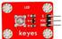
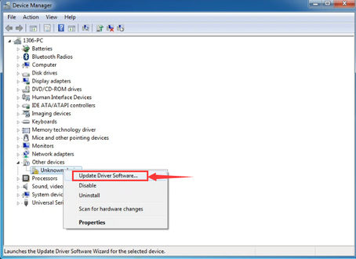
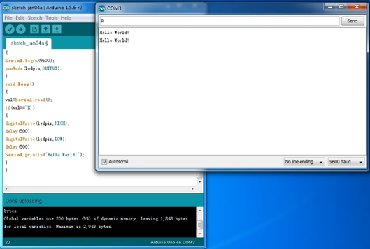

Keyes 电子积木传感器套件 for Arduino

# 说明

这个套件包含我们学习Arduino单片机常用到的21款传感器模块和Arduino控制板。

同时我们为套件里的每一款传感器都编写了资料，资料里介绍了传感器模块基于Arduino控制板的使用方法，包含了接线方法、测试代码、实验结果等信息。

# 清单

|编码|名称|描述|数量|图片|
|-|-|-|-|-|
|1|Keyes模块|keyes 草帽LED白发红模块(焊盘孔) 红色 环保|1||
|2|Keyes模块|keyes 草帽LED白发绿模块(焊盘孔) 红色 环保|1||
|3|Keyes模块|keyes 草帽LED白发蓝模块(焊盘孔) 红色 环保|1||
|4|Keyes模块|keyes 无源蜂鸣器模块(焊盘孔) 红色 环保|1||
|5|Keyes模块|keyes 双色LED模块(焊盘孔) 红色 环保|1||
|6|Keyes模块|keyes 5V 单路继电器模块(焊盘孔) 红色 环保|1||
|7|keyes传感器|keyes 光敏电阻传感器(焊盘孔) 红色 环保|1||
|8|keyes传感器|keyes 倾斜模块传感器(焊盘孔) 红色 环保|1||
|9|keyes传感器|keyes 麦克风声音传感器(焊盘孔) 红色 环保|1||
|10|keyes传感器|keyes MQ-2 烟雾传感器(焊盘孔) 红色 环保|1||
|11|keyes传感器|keyes 热敏电阻传感器(焊盘孔) 红色 环保|1||
|12|keyes传感器|keyes LM35温度传感器(焊盘孔) 红色 环保|1||
|13|keyes传感器|keyes 水位传感器(焊盘孔) 红色 环保|1||
|14|keyes传感器|keyes 土壤传感器(焊盘孔) 红色 环保|1||
|15|keyes传感器|keyes DHT11温湿度传感器(焊盘孔) 红色 环保|1||
|16|keyes传感器|keyes 超声波传感器(焊盘孔) 红色 环保|1||
|17|keyes传感器|keyes 火焰传感器(焊盘孔) 红色 环保|1||
|18|keyes传感器|keyes 1302时钟传感器(焊盘孔) 红色 环保|1||
|19|keyes传感器|keyes 摇杆模块传感器(焊盘孔) 红色 环保|1||
|20|keyes传感器|keyes 水滴水蒸气传感器(焊盘孔) 红色 环保|1||
|21|keyes传感器|keyes 人体红外热释电传感器(焊盘孔) 红色 环保|1||
|22|杜邦线|公对母20CM/40P/2.54/12股铜丝24号线|1||
|23|USB线|AM/BM 透明蓝 OD:5.0 L=50cm|1||
|48|KE0087开发板|Keyes UNO R3 开发板 for arduino 红色 环保|1||
|48|KE0088开发板|Keyes 2560 R3 开发板 for arduino 红色 环保|1||

# Arduino IDE和驱动的安装

当我们拿到开发板时，首先我们要安装Arduino IDE和驱动，相关文件我们可以在官网上找到，以下链接是包含各种系统、各种版本的Arduino IDE和驱动任你选择。

<https://www.arduino.cc/en/Main/OldSoftwareReleases#1.5.x>

下面我们介绍下Arduino-1.5.6 版本IDE在Windows系统的安装方法。

下载下来的文件是一个arduino-1.5.6-r2-windows.zip的压缩文件夹，解压出来到硬盘。

双击Arduino-1.5.6 .exe文件

然后

然后

等待安装完成.点击close，安装完成。

1.5.6版本安装后的样子。

接下来是开发板驱动的安装，这次我们安装的是Keyes UNO R3开发板的驱动，Keyes 2560 R3开发板安装驱动方法和这个类似，驱动文件可以用同一个文件。

不同的系统，安装驱动的方法也有一些细小的区别，下面我们介绍在WIN 7系统安装驱动的方法。

第一次Keyes UNO R3开发板连接电脑时，点击计算机--属性--设备管理器，显示如下图。

点击 Unknown device 安装驱动，如下图。

进入下图，选择

找到Arduino安装位置的drivers文件夹

点击“Next”，今天下图选择，开始安装驱动

安装驱动完成，出现下图点击Close。

这样驱动就装好了。点击计算机--属性--设备管理器，我们可看见如下图。

# Arduino IDE的使用方法

Keyes UNO R3开发板的USB驱动安装成功之后，我们可以在Windows设备管理器中找到相应的串口。

下面示范第一个程序的烧写，串口监视器中显示“Hello World！”。

测试代码为：

int val;

int ledpin=13;

void setup()

{

Serial.begin(9600);

pinMode(ledpin,OUTPUT);

}

void loop()

{

val=Serial.read();

if(val=='R')

{

digitalWrite(ledpin,HIGH);

delay(500);

digitalWrite(ledpin,LOW);

delay(500);

Serial.println("Hello World!");

}

}

我们打开Arduino 的软件，编写一段程序让Keyes UNO R3开发板接受到我们发的指令就显示“Hello World！”字符串；我们再借用一下Keyes UNO R3 开发板上的 D13的指示灯，让Keyes UNO R3开发板接受到指令时指示灯闪烁一下，再显示“Hello World！”。

打开Arduino 的软件，设置板，如下。

设置COM端口，如下

点击编译程序，检查程序是否错误；点击上传程序；Keyes UNO R3 开发板设置OK后右下脚显示如下图，和设备管理器中显示一致。

上传成功，输入R，点击发送，Keyes UNO R3 开发板上的 D13的指示灯闪烁一次，串口监视器中显示 Hello World! 如下图

那么恭喜你，你的第一个程序已经成功了！！！

# 实验课程

## 实验一 草帽LED模块 

实验说明

本实验我们主要用来检测草帽LED模块。实验中我们将草帽LED模块的信号端接在开发板数字口3上，它同时也是PWM口。我们用两个实验检测，一个是让草帽LED进行闪烁实验;另一个是让PWM口控制草帽LED的亮度，让草帽LED逐渐变亮和逐渐变暗，模拟人体呼吸的现象。

实验器材

开发板\*1

USB线\*1

草帽LED模块\*1

杜邦线若干

接线图

连接Keyes UNO R3

连接Keyes 2560 R3

测试代码

代码A:

int led = 3; //定义数字口3

void setup()

{

  pinMode(led, OUTPUT);     //设置led为输出

}

void loop()

{

  digitalWrite(led, HIGH);   //开启led

  delay(1000); //延迟1秒

  digitalWrite(led, LOW);    //关闭led

  delay(1000);//延迟1秒

}

代码B:

int ledPin = 3; // 定义数字口3

void setup()

{

pinMode(ledPin, OUTPUT);// 将ledPin设置为输出

}

void loop()

{

for (int a=0; a\<=255;a++)// 设置使LED逐渐变亮

{

analogWrite(ledPin,a); //开启led,调节亮度，范围是0-255，在255时led最亮

delay(10); // 延迟0.01秒

}

for (int a=255; a\>=0;a--) // 设置使LED逐渐变暗

{

analogWrite(ledPin,a); //开启led,调节亮度，范围是0-255，在255时led最亮

delay(10); // 延迟0.01秒

}

delay(1000);// 延迟1秒

}

测试结果

上传完代码A，上电后
，我们就可以看到草帽LED不停闪烁，间隔大约为1秒。上传完代码B，上电后
，我们就可以看到草帽LED先逐渐变亮，后逐渐变暗，循环交替。

## 实验二 无源蜂鸣器模块 

实验说明

本实验我们主要用来检测草无源蜂鸣器模块。蜂鸣器可分为有源蜂鸣器和无源蜂鸣器两种。无源蜂鸣器内部不带振荡源，直流信号无法令其鸣叫，须用方波驱动。

实验中我们将无源蜂鸣器模块的信号端接在开发板的数字口3上，通过开发板控制数字口3输出方波，从而驱动无源蜂鸣器。我们用两个实验检测，一个是让数字口3循环输出两种频率的方波，驱动无源蜂鸣器响起;另一个是我们让数字口3输出各种频率的方波，并且设定好节奏，从而让无源蜂鸣器播放《欢乐颂》的曲子。

实验器材

开发板\*1

USB线\*1

无源蜂鸣器模块\*1

杜邦线若干

接线图

连接Keyes UNO R3

连接Keyes 2560 R3

测试代码

代码A:

int buzzer=3; //定义数字口3

void setup()

{

pinMode(buzzer,OUTPUT);//将buzzer设置为输出

}

void loop()

{

unsigned char i,j;//定义变量i，j

while(1)

{

for(i=0;i\<80;i++)// 输出一个频率的声音

{

digitalWrite(buzzer,HIGH);

delay(1);//延迟1ms

digitalWrite(buzzer,LOW);

delay(1);//延迟1ms

}

for(i=0;i\<100;i++)// 输出另一个频率的声音

{

digitalWrite(buzzer,HIGH);

delay(2);//延迟2ms

digitalWrite(buzzer,LOW);

delay(2);//延迟2ms

}

}

}

代码B:

\#define D0 -1

\#define D1 262

\#define D2 293

\#define D3 329

\#define D4 349

\#define D5 392

\#define D6 440

\#define D7 494

\#define M1 523

\#define M2 586

\#define M3 658

\#define M4 697

\#define M5 783

\#define M6 879

\#define M7 987

\#define H1 1045

\#define H2 1171

\#define H3 1316

\#define H4 1393

\#define H5 1563

\#define H6 1755

\#define H7 1971

//列出全部D调的频率

\#define WHOLE 1

\#define HALF 0.5

\#define QUARTER 0.25

\#define EIGHTH 0.25

\#define SIXTEENTH 0.625

//列出所有节拍

int tune\[\]= //根据简谱列出各频率

{

M3,M3,M4,M5,

M5,M4,M3,M2,

M1,M1,M2,M3,

M3,M2,M2,

M3,M3,M4,M5,

M5,M4,M3,M2,

M1,M1,M2,M3,

M2,M1,M1,

M2,M2,M3,M1,

M2,M3,M4,M3,M1,

M2,M3,M4,M3,M2,

M1,M2,D5,D0,

M3,M3,M4,M5,

M5,M4,M3,M4,M2,

M1,M1,M2,M3,

M2,M1,M1

};

float durt\[\]= //根据简谱列出各节拍

{

1,1,1,1,

1,1,1,1,

1,1,1,1,

1+0.5,0.5,1+1,

1,1,1,1,

1,1,1,1,

1,1,1,1,

1+0.5,0.5,1+1,

1,1,1,1,

1,0.5,0.5,1,1,

1,0.5,0.5,1,1,

1,1,1,1,

1,1,1,1,

1,1,1,0.5,0.5,

1,1,1,1,

1+0.5,0.5,1+1,

};

int length;

int tonepin=3; //得用3号接口

void setup()

{

pinMode(tonepin,OUTPUT);

length=sizeof(tune)/sizeof(tune\[0\]); //计算长度

}

void loop()

{

for(int x=0;x\<length;x++)

{

tone(tonepin,tune\[x\]);

delay(500\*durt\[x\]);
//这里用来根据节拍调节延时，500这个指数可以自己调整，在该音乐中，我发现用500比较合适。

noTone(tonepin);

}

delay(2000);

}

测试结果

上传完代码A，上电后，无源蜂鸣器会发出两种不同的声音，两种声音循环交替。上传完代码B，上电后，无源蜂鸣器会想响起《欢乐颂》的曲子。

## 实验三 双色LED模块 

实验说明

本实验我们主要用来检测双色LED模块。双色LED模块采用共阴驱动，发光颜色为红色和绿色，通过两个PWM口我们可以调节显示红色和绿色的比例，组合成其他颜色。实验中我们把双色LED模块的信号端接在数字口5和6上，它同时也是PWM口。实验中我们让双色LED模块循环显示红色和绿色。

实验器材

开发板\*1

USB线\*1

双色LED模块\*1

杜邦线若干

接线图

连接Keyes UNO R3

连接Keyes 2560 R3

测试代码

int redPin = 5; // R 红色LED 控制引脚 连接到Arduino的 5脚

int greenPin = 6; // G绿色LED 控制引脚 连接到Arduino的6脚

void setup()

{

pinMode(redPin, OUTPUT); //设置redPin对应的管脚5为输出

pinMode(greenPin, OUTPUT); //设置greenPin,对应的管脚6为输出

}

void loop()

{

// Basic colors:

color(255, 0); // 红色亮

delay(1000); // 延时一秒

color(0,255); //绿色亮

delay(1000); //延时一秒

}

void color (unsigned char red, unsigned char green) //颜色控制函数

{

analogWrite(redPin, red);

analogWrite(greenPin,green);

}

测试结果

上传完代码，上电后
，我们就可以看到双色LED模块上LED显示红色1秒，绿色1秒，循环交替。

## 实验四 5V单路继电器模块 

实验说明

本实验我们主要用来检测5V
单路继电器模块。这个继电器模块是高电平有效，我们把继电器模块的信号端接在数字口3。实验中我们通过开发板控制数字口3，控制模块上继电器循环开启和关闭。

实验器材

开发板\*1

USB线\*1

5V 单路继电器模块\*1

杜邦线若干

接线图

连接Keyes UNO R3

连接Keyes 2560 R3

测试代码

int Relay = 3; //定义数字口3

void setup()

{

pinMode(Relay, OUTPUT); //将Relay设置为输出

}

void loop()

{

digitalWrite(Relay, HIGH); //打开继电器

delay(2000); //延时2秒

digitalWrite(Relay, LOW); //关闭继电器

delay(2000); //延时2秒

}

测试结果

按照上图接好线，上传好代码，上电后，继电器开启（ON端连通，NC断开）2秒，停止（ON端断开，NC端连通）2秒，循环交替，开启时继电器上D2灯亮起。

## 实验五 光敏电阻传感器

实验说明

本实验我们主要用来检测光敏电阻传感器。这个传感器对环境光线最敏感，一般用来检测周围环境的光线的亮度，触发单片机或继电器模块等。实验中将传感器的信号端接到开发板的模拟口A0，在Arduino IDE的串口监视器上可看到对应的模拟值输出。

实验器材

开发板\*1

USB线\*1

光敏电阻传感器\*1

杜邦线若干

接线图

连接Keyes UNO R3

连接Keyes 2560 R3

测试代码

int sensorPin =A0 ; //定义模拟口A0

int value = 0; //设置value为0

void setup()

{

Serial.begin(9600); //设置波特率

}

void loop()

{

value = analogRead(sensorPin); //将value设置为读取到的A0的数值

Serial.println(value, DEC); //显示value数值，并自动换行

delay(200); //延迟0.2秒

}

测试结果

按照上图接好线，上传好代码，上电后，我们可以在软件的串口监视器中看到代表当前光线强弱的模拟值，光线越强，数值越大，如下图。

## 实验六 倾斜模块传感器

实验说明

本实验我们主要用来检测倾斜模块传感器。这个传感器主要是利用滚珠在开关内随不同倾斜角度的发化，达到触发电路的目的；可用于倾斜检测、报警器制作或者其他检测。实验中我们用到了Arduino UNO 板上自带的D13 的指示灯，通过传感器，控制D13 的指示灯的亮灭。

实验器材

开发板\*1

USB线\*1

倾斜模块传感器\*1

杜邦线若干

接线图

连接Keyes UNO R3

连接Keyes 2560 R3

测试代码

int ledPin = 13; //定义数字口13

int switcher = 3; // 定义数字口3

void setup()

{

pinMode(ledPin, OUTPUT); // 将ledPin设置为输出

pinMode(switcher, INPUT); //将switcher设置为输入

}

void loop()

{

if(digitalRead(switcher)==HIGH) //当读取数字口3，并发现为高电平

{

digitalWrite(ledPin, HIGH); // LED亮起

}

else

{

digitalWrite(ledPin, LOW); // LED变暗

}

}

测试结果

按照上图接好线，上传好代码，上电后，倾斜一方时 Arduino UNO 板上的 D13
的指示灯亮，数字倾斜模块上D1灯灭；倾斜另一方时 Arduino UNO 板上的 D13
的指示灯灭，数字倾斜模块上D1灯亮。

## 实验七 麦克风声音传感器

实验说明

本实验我们主要用来检测麦克风声音传感器。这个传感器的S端是模拟输出，是麦克风的电压信号实时输出，通过电位器可调节信号增益。实验中将传感器的S端接到开发板的模拟口A0，在Arduino IDE的串口监视器上可看到对应的模拟值输出。

实验器材

开发板\*1

USB线\*1

麦克风声音传感器\*1

杜邦线若干

接线图

连接Keyes UNO R3

连接Keyes 2560 R3

测试代码

int sensorPin =A0 ; //定义模拟口A0

int value = 0; //设置value为0

void setup()

{

Serial.begin(9600); //设置波特率

}

void loop()

{

value = analogRead(sensorPin); //将value设置为读取到的A0的数值

Serial.println(value, DEC); //显示value数值，并自动换行

delay(100); //延迟0.1秒

}

测试结果

按照上图接好线，上传好代码，上电后，我们可以在软件的串口监视器相对应模拟值，如下图。声音越大模拟值越大。

## 实验八 MQ-2 烟雾传感器

实验说明

本实验我们主要用来检测MQ-2
烟雾传感器。该传感器所使用的气敏材料是在清洁空气中电导率较低的二氧化锡(SnO2)。当传感器所处环境中存在可燃气体时，传感器的电导率随空气中可燃气体浓度的增加而增大。MQ-2
气体传感器对液化气、丙烷、氢气的灵敏度高，对天然气和其它可燃蒸汽的检测也很理想。它可检测多种可燃性气体，是一款适合多种应用的低成本传感器。

实验中将传感器的S端接到开发板的模拟口A0，在Arduino IDE的串口监视器上可看到对应的模拟值输出。

实验器材

开发板\*1

USB线\*1

MQ-2 烟雾传感器\*1

杜邦线若干

接线图

连接Keyes UNO R3

连接Keyes 2560 R3

测试代码

void setup() {

Serial.begin(9600); //设置波特率

}

void loop() {

int sensorValue = analogRead(A0);
//读取到的A0的数值，并赋值给数字变量sensorValue

Serial.println(sensorValue, DEC); //显示sensorValue数值，并自动换行

delay(100); //延迟0.1秒

}

测试结果

按照上图接好线，上传好代码，上电后，传感器上D1灯亮起，调节电位器可调节灵敏度；打开窗口监视器，可看到相对应的模拟值。检测到气体浓度越高，模拟值越大。

## 实验九 热敏电阻传感器

实验说明

本实验我们主要用来检测热敏电阻传感器。它是基于热敏电阻的工作原理，能够实时感知周边环境温度的变化，我们把数据送到
Arduino的模拟口，接来下我们只要经过简单的编程就能将传感器输出的数据转换为摄氏温度值，并加以显示，借此广泛应用于园艺、家庭警报系统等装置中。

实验中将传感器的信号端接到开发板的模拟口A0，在Arduino IDE的串口监视器上可看到当前环境中的温度值。

实验器材

开发板\*1

USB线\*1

热敏电阻传感器\*1

杜邦线若干

接线图

连接Keyes UNO R3

连接Keyes 2560 R3

测试代码

\#include \<math.h\>

double Thermister(int RawADC) {

double Temp;

Temp = log(((10240000/RawADC) - 10000));

Temp = 1 / (0.001129148 + (0.000234125 + (0.0000000876741 \* Temp \*
Temp ))\* Temp );

Temp = Temp - 273.15; // Convert Kelvin to Celcius

return Temp;

}

void setup()

{

Serial.begin(9600); //设置波特率

}

void loop()

{

Serial.print(Thermister(analogRead(0))); // 显示计算的温度值

Serial.println("c"); // 显示c，并自动换行

delay(500); // 延迟0.5S

}

测试结果

按照上图接好线，上传好代码，上电后，我们可以在软件的串口监视器中看到当前环境中的温度值，如下图。

## 实验十 LM35温度传感器

实验说明

本实验我们主要用来检测LM35温度传感器。它的输出电压与摄氏温标呈线性关系，转换公式如式，0时输出为0V，每升高1℃，输出电压增加10mV。

实验中将传感器的信号端接到开发板的模拟口A0，在Arduino IDE的串口监视器上可看到当前环境中的温度值。

实验器材

开发板\*1

USB线\*1

LM35温度传感器\*1

杜邦线若干

接线图

连接Keyes UNO R3

连接Keyes 2560 R3

测试代码

void setup()

{

Serial.begin(9600);//设置波特率

}

void loop()

{

int val; //定义数字变量val

int dat;//定义数字变量dat

val=analogRead(0);//将val设置为读取到的A0的数值

dat=(500 \* val) /1024; //计算出当前温度数字dat

Serial.print("Temp:"); //显示 Temp:

Serial.print(dat); //显示计算的温度值

Serial.println("C");//显示C，并自动换行

delay(500); //延迟0.5S

}

测试结果

按照上图接好线，上传好代码，上电后，我们可以在软件的串口监视器中看到当前环境中的温度值，如下图。

## 实验十一 水位传感器

实验说明

本实验我们主要用来检测水位传感器。它是一款简单易用、性价比较高的水位/水滴识别检测传感器，是通过具有一系列的暴露的平行导线线迹测量其水滴/水量大小从而判断水位。

实验中将传感器的信号端接到开发板的模拟口A0，在Arduino IDE的串口监视器上可看到代表当前水位的模拟值。

实验器材

开发板\*1

USB线\*1

水位传感器\*1

杜邦线若干

接线图

连接Keyes UNO R3

连接Keyes 2560 R3

测试代码

void setup() {

Serial.begin(9600); //设置波特率

}

void loop() {

int sensorValue = analogRead(A0);
//读取到的A0的数值，并赋值给数字变量sensorValue

Serial.println(sensorValue, DEC); //显示sensorValue数值，并自动换行

delay(100); //延迟0.1秒

}

测试结果

按照上图接好线，上传好代码，上电后，水位传感器上D1灯亮起；打开窗口监视器，显示如图一；将传感器的感应位置放入水中，显示如图二；感应位置放入水中越深，数字越大。

图一

图二

## 实验十二 土壤传感器

实验说明

本实验我们主要用来检测土壤传感器。它是一个简易的水份传感器可用于检测土壤的水份，当土壤缺水时，传感器输出的模拟值将减小，反之将增大。使用这个传感器可制作一款自动浇花装置。

实验中将传感器的信号端接到开发板的模拟口A0，在Arduino IDE的串口监视器上可看到代表当前土壤湿度的模拟值。

实验器材

开发板\*1

USB线\*1

土壤传感器\*1

杜邦线若干

接线图

连接Keyes UNO R3

连接Keyes 2560 R3

测试代码

void setup() {

Serial.begin(9600); //设置波特率

}

void loop() {

int sensorValue = analogRead(A0);
//读取到的A0的数值，并赋值给数字变量sensorValue

Serial.println(sensorValue, DEC); //显示sensorValue数值，并自动换行

delay(100); //延迟0.1秒

}

测试结果

按照上图接好线，上传好代码，上电后，土壤传感器上D1灯亮起；打开窗口监视器，显示如图一；将传感器插入土中，如图二；土壤湿度越大，数字越大。

图一

图二

## 实验十三 DHT11温湿度传感器

实验说明

本实验我们主要用来检测DHT11温湿度传感器。它是一款含有已校准数字信号输出的温湿度复合传感器，它应用专用的数字模块采集技术和温湿度传感技术，确保产品具有极高的可靠性和卓越的长期稳定性。

实验中将传感器的信号端接到开发板的数字口3，在Arduino IDE的串口监视器上可看到当前环境中的温度值和湿度值。

实验器材

开发板\*1

USB线\*1

DHT11温湿度传感器\*1

杜邦线若干

接线图

连接Keyes UNO R3

连接Keyes 2560 R3

测试代码

\#include \<dht11.h\>

dht11 DHT;

\#define DHT11_PIN 3

void setup(){

Serial.begin(9600);

Serial.println("DHT TEST PROGRAM ");

Serial.print("LIBRARY VERSION: ");

Serial.println(DHT11LIB_VERSION);

Serial.println();

Serial.println("Type,\tstatus,\tHumidity (%),\tTemperature (C)");

}

void loop(){

int chk;

Serial.print("DHT11, \t");

chk = DHT.read(DHT11_PIN); // READ DATA

switch (chk){

case DHTLIB_OK:

Serial.print("OK,\t");

break;

case DHTLIB_ERROR_CHECKSUM:

Serial.print("Checksum error,\t");

break;

case DHTLIB_ERROR_TIMEOUT:

Serial.print("Time out error,\t");

break;

default:

Serial.print("Unknown error,\t");

break;

}

// DISPLAT DATA

Serial.print(DHT.humidity,1);

Serial.print(",\t");

Serial.println(DHT.temperature,1);

delay(1000);

}

库文件下载地址

<https://pan.baidu.com/s/1eSlMYD8>

测试结果

按照上图接好线，上传好代码，上电后，我们可在软件串口监视器中看到当前环境中的温度值和湿度值，如下图。

## 实验十四 超声波传感器

实验说明

本实验我们主要用来检测超声波传感器。该传感器主要用于测距，它具有高精度、盲区（2cm）超近、性能稳定的特点。

实验中将传感器的信号端接到开发板的数字口7和数字口8，在Arduino IDE的串口监视器上可看到超声波传感器和前方障碍物之间的距离。

实验器材

开发板\*1

USB线\*1

超声波传感器\*1

杜邦线若干

接线图

连接Keyes UNO R3

连接Keyes 2560 R3

测试代码

\#define echoPin 7 // Echo Pin

\#define trigPin 8 // Trigger Pin

\#define LEDPin 13 // Onboard LED

int maximumRange = 200; // Maximum range needed

int minimumRange = 0; // Minimum range needed

long duration, distance; // Duration used to calculate distance

void setup() {

Serial.begin (9600);

pinMode(trigPin, OUTPUT);

pinMode(echoPin, INPUT);

pinMode(LEDPin, OUTPUT); // Use LED indicator (if required)

}

void loop() {

/\* The following trigPin/echoPin cycle is used to determine the

distance of the nearest object by bouncing soundwaves off of it. \*/

digitalWrite(trigPin, LOW);

delayMicroseconds(2);

digitalWrite(trigPin, HIGH);

delayMicroseconds(10);

digitalWrite(trigPin, LOW);

duration = pulseIn(echoPin, HIGH);

//Calculate the distance (in cm) based on the speed of sound.

distance = duration/58.2;

if (distance \>= maximumRange || distance \<= minimumRange){

/\* Send a negative number to computer and Turn LED ON

to indicate "out of range" \*/

Serial.println("-1");

digitalWrite(LEDPin, HIGH);

}

else {

/\* Send the distance to the computer using Serial protocol, and

turn LED OFF to indicate successful reading. \*/

Serial.println(distance);

digitalWrite(LEDPin, LOW);

}

//Delay 50ms before next reading.

delay(50);

}

测试结果

按照上图接好线，上传好代码，上电后，打开串口监视器，即可看到超声波传感器和前方障碍物之间的距离，单位为cm，显示如下图。

## 实验十五 火焰传感器

实验说明

本实验我们主要用来检测火焰传感器。它可以检测火焰或者波长在760纳米～1100纳米范围内的光源，它的探测角度为60度左右，它对火焰光谱特别灵敏并且灵敏度可调，性能稳定，是救火机器人必备部件。

实验中我们用到了Arduino UNO 板上自带的D13
的指示灯，通过传感器，控制D13 的指示灯的亮灭。

实验器材

开发板\*1

USB线\*1

火焰传感器\*1

杜邦线若干

接线图

连接Keyes UNO R3

连接Keyes 2560 R3

测试代码

const int flamePin = 3; //定义数字口3

const int ledPin = 13; //定义数字口13

// variables will change:

int State = 0; //定义数字变量State，并设为0

void setup()

{

pinMode(ledPin, OUTPUT); //将ledPin设置为输出

pinMode(flamePin, INPUT); //将flamePin设置为输入

}

void loop()

{

State = digitalRead(flamePin);//读取到数字口3的数值，并赋值给 State

if (State == LOW) //当sensorState为低电平时，LED亮起

{

digitalWrite(ledPin, HIGH); //LED亮起

}

else

{

digitalWrite(ledPin, LOW); //LED变暗

}

}

测试结果

按照上图接好线，上传好代码，上电后，调节模块电位器，使模块上D1处于亮起和关闭临界点，使D1关闭。传感器没有检测到火焰时，传感器上的D1灯关闭，Arduino UNO 板上的 D13
的指示灯关闭；当传感器检测到火焰时，传感器上的D1灯亮起，Arduino UNO
板上的 D13 的指示灯亮起。

## 实验十六 1302时钟传感器

实验说明

本实验我们主要用来检测1302时钟传感器。DS1302 是DALLAS
公司推出的涓流充电时钟芯片，内含有一个实时时钟/日历和31 字节静态RAM
，通过简单的串行接口与单片机进行通信。实时时钟/日历电路提供秒、分、时、日、周、月、年的信息，每月的天数和闰年的天数可自动调整。时钟操作可通过AM/PM
指示决定采用24 或12 小时格式。DS1302
与单片机之间能简单地采用同步串行的方式进行通信，仅需用到三个口线：（1）RST
复位（2）I/O 数据线（3）SCLK串行时钟。时钟/RAM
的读/写数据以一个字节或多达31 个字节的字符组方式通信。DS1302
工作时功耗很低保持数据和时钟信息时功率小于1mW。

实验中我们用开发板控制1302时钟传感器，让它在软件的串口监视器中显示当前时间日期，并且自动读秒。

实验器材

开发板\*1

USB线\*1

1302时钟传感器\*1

杜邦线若干

接线图

连接Keyes UNO R3

连接Keyes 2560 R3

测试代码

\#include \<stdio.h\>

\#include \<string.h\>

\#include \<DS1302.h\>

/\* 接口定义

CE(DS1302 pin5) -\> Arduino D5 (RST)

IO(DS1302 pin6) -\> Arduino D6 (DAT)

SCLK(DS1302 pin7) -\> Arduino D7 (CLK)

\*/

uint8_t CE_PIN = 5;

uint8_t IO_PIN = 6;

uint8_t SCLK_PIN = 7;

/\* 日期变量缓存 \*/

char buf\[50\];

char day\[10\];

/\* 创建 DS1302 对象 \*/

DS1302 rtc(CE_PIN, IO_PIN, SCLK_PIN);

void print_time()

{

/\* 从 DS1302 获取当前时间 \*/

Time t = rtc.time();

/\* 将星期从数字转换为名称 \*/

memset(day, 0, sizeof(day));

switch (t.day) {

case 1:

strcpy(day, "Sunday");

break;

case 2:

strcpy(day, "Monday");

break;

case 3:

strcpy(day, "Tuesday");

break;

case 4:

strcpy(day, "Wednesday");

break;

case 5:

strcpy(day, "Thursday");

break;

case 6:

strcpy(day, "Friday");

break;

case 7:

strcpy(day, "Saturday");

break;

}

/\* 将日期代码格式化凑成buf等待输出 \*/

snprintf(buf, sizeof(buf), "%s %04d-%02d-%02d %02d:%02d:%02d",

day,

t.yr, t.mon, t.date,

t.hr, t.min, t.sec);

/\* 输出日期到串口 \*/

Serial.println(buf);

}

void setup()

{

Serial.begin(9600); //设置波特率

rtc.write_protect(false);

rtc.halt(false);

/\*设置开始时间为2017年12月28日15点32分33秒星期四 \*/

Time t(2017,12, 28, 15, 32, 33, 5);

rtc.time(t);

}

/\* 每一秒循环输出时间 \*/

void loop()

{

print_time();

delay(1000);

}

库文件下载地址

<https://pan.baidu.com/s/1o8Ogz0I>

测试结果

按照上图接好线，上传好代码，上电后，通电后，我们可在软件串口监视器中看到当前时间日期，并计时，如下图。

## 实验十七 摇杆模块传感器

实验说明

本实验我们主要用来检测摇杆模块传感器。它使用5V供电，信号端X,Y接模拟口，原始状态下读出电压为2.5V左右，当随箭头方向按下，读出电压值随着增加，最大到5V，箭头相反方向按下，读出电压值减少，最小为0V；信号端B接数字口，原始状态下输出0，按下输出1。

实验中我们将摇杆模块传感器信号端接到开发板上的两个模拟口和一个数字口上，然后在软件的串口监视器显示对应数据，根据数据，我们可以知道摇杆模块传感器具体状态。

实验器材

开发板\*1

USB线\*1

摇杆模块传感器\*1

杜邦线若干

接线图

连接Keyes UNO R3

连接Keyes 2560 R3

测试代码

int JoyStick_X = 0; //定义模拟口A0

int JoyStick_Y = 1; //定义模拟口A1

int JoyStick_Z = 3; //定义数字口3

void setup()

{

pinMode(JoyStick_Z, INPUT);//将JoyStick_Z设置为输入

Serial.begin(9600); // 设置波特率

}

void loop()

{

int x,y,z; //定义数字变量x y z

x=analogRead(JoyStick_X); //将x设置为读取到的A0的数值

y=analogRead(JoyStick_Y);//将y设置为读取到的A1的数值

z=digitalRead(JoyStick_Z);//将z设置为读取到的数字口3的数值

Serial.print(x ,DEC); //显示x的数值

Serial.print(","); //显示逗号

Serial.print(y ,DEC);//显示y的数值

Serial.print(",");//显示逗号

Serial.println(z ,DEC);//显示z的数值，并自动换行

delay(100);//延迟0.1S

}

测试结果

按照上图接好线，上传好代码，上电后，通电后，将 X 轴向左移，X
轴数据在0-512 范围内，X 轴向右移，X 轴数据在 512-1023 范围内；将 Y
轴向上移，Y 轴数据在 0-512范围内，Y 轴向下移，Y 轴数据在 512-1023
范围内，如附图；Z 轴方向为 0，按下摇杆后，Z 轴显示 1。

## 实验十八 水滴水蒸气传感器

实验说明

本实验我们主要用来水滴水蒸气传感器。它是一个模拟传感器，可以制作简单的雨水探测器与液位开关。当传感器表面的湿度上升，输出电压将增大。

实验中将传感器的信号端接到开发板的模拟口A0，在Arduino IDE的串口监视器上可看到代表湿度的模拟值。

实验器材

开发板\*1

USB线\*1

水滴水蒸气传感器\*1

杜邦线若干

接线图

连接Keyes UNO R3

连接Keyes 2560 R3

测试代码

void setup() {

Serial.begin(9600); //设置波特率

}

void loop() {

int sensorValue = analogRead(A0);
//读取到的A0的数值，并赋值给数字变量sensorValue

Serial.println(sensorValue, DEC); //显示sensorValue数值，并自动换行

delay(100); //延迟0.1秒

}

测试结果

按照上图接好线，上传好代码，上电后，打开窗口监视器，显示如图一；在传感器的感应位置滴上水滴，显示如图二。

图一

图二

## 实验十九 人体红外热释电传感器

实验说明

本实验我们主要用来人体红外热释电传感器。它是基于红外线技术的自动控制产品。它具有灵敏度高、可靠性强、超低功耗，超低电压工作模式等特点，广泛应用于各类自动感应电器设备,尤其是干电池供电的自动控制产品。我们可以通过调节两个电位器调节感应距离和感应延时。调节距离电位器顺时针旋转，感应距离增大（约7米），反之，感应距离减小（约3米）。调节延时电位器顺时针旋转，感应延时加长（约300S），反之，感应延时减短（约5S）。

实验中我们用到了Arduino UNO 板上自带的D13
的指示灯，通过传感器感应附近是否有人体运动，控制D13 的指示灯的亮灭。

实验器材

开发板\*1

USB线\*1

人体红外热释电传感器\*1

杜邦线若干

接线图

连接Keyes UNO R3

连接Keyes 2560 R3

测试代码

byte sensorPin = 3;//定义数字口3

byte indicator = 13;//定义数字口13

void setup()

{

pinMode(sensorPin,INPUT);//设置数字口3位输入

pinMode(indicator,OUTPUT);//设置数字口13为输出

Serial.begin(9600);//设置波特率

}

void loop()

{

byte state = digitalRead(sensorPin);//读取到数字口3的数值赋值给state

digitalWrite(indicator,state);//控制数值口13的状态

if(state ==
1)//当数值口3位高电平时，串口监视器输出对应字符，并自动换行

Serial.println("Somebody is in this area!");

else if(state == 0)
//当数值口3位低电平时，串口监视器输出对应字符，并自动换行

Serial.println("No one!");

delay(500);//延迟0.5S

}

测试结果

按照上图接好线，上传好代码，上电后，检测到人体运动时Arduino UNO板上D13的指示灯亮起，串口监视器中显示"Somebody is in this area!"；没有检测到人体运动时Arduino UNO板上D13的指示灯熄灭，串口监视器中显示"No one!"。

# 相关资料链接

[https://pan.baidu.com/s/1geT4fTL](https://pan.baidu.com/s/1geT4fTL)

