# 清单

|编码|名称|描述|数量|图片|
|-|-|-|-|-|
|1|Keyes模块|keyes 草帽LED白发红模块(焊盘孔) 红色 环保|1|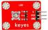|
|2|Keyes模块|keyes 草帽LED白发绿模块(焊盘孔) 红色 环保|1|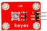|
|3|Keyes模块|keyes 草帽LED白发蓝模块(焊盘孔) 红色 环保|1|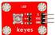|
|4|Keyes模块|keyes 无源蜂鸣器模块(焊盘孔) 红色 环保|1|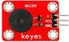|
|5|Keyes模块|keyes 双色LED模块(焊盘孔) 红色 环保|1||
|6|Keyes模块|keyes 5V 单路继电器模块(焊盘孔) 红色 环保|1||
|7|keyes传感器|keyes 光敏电阻传感器(焊盘孔) 红色 环保|1||
|8|keyes传感器|keyes 倾斜模块传感器(焊盘孔) 红色 环保|1||
|9|keyes传感器|keyes 麦克风声音传感器(焊盘孔) 红色 环保|1||
|10|keyes传感器|keyes MQ-2 烟雾传感器(焊盘孔) 红色 环保|1|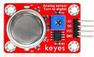|
|11|keyes传感器|keyes 热敏电阻传感器(焊盘孔) 红色 环保|1||
|12|keyes传感器|keyes LM35温度传感器(焊盘孔) 红色 环保|1|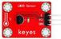|
|13|keyes传感器|keyes 水位传感器(焊盘孔) 红色 环保|1|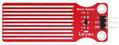|
|14|keyes传感器|keyes 土壤传感器(焊盘孔) 红色 环保|1|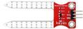|
|15|keyes传感器|keyes DHT11温湿度传感器(焊盘孔) 红色 环保|1|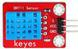|
|16|keyes传感器|keyes 超声波传感器(焊盘孔) 红色 环保|1|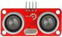|
|17|keyes传感器|keyes 火焰传感器(焊盘孔) 红色 环保|1|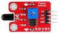|
|18|keyes传感器|keyes 1302时钟传感器(焊盘孔) 红色 环保|1|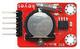|
|19|keyes传感器|keyes 摇杆模块传感器(焊盘孔) 红色 环保|1|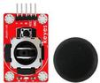|
|20|keyes传感器|keyes 水滴水蒸气传感器(焊盘孔) 红色 环保|1|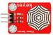|
|21|keyes传感器|keyes 人体红外热释电传感器(焊盘孔) 红色 环保|1|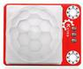|
|22|杜邦线|公对母20CM/40P/2.54/12股铜丝24号线|1||
|23|USB线|AM/BM 透明蓝 OD:5.0 L=50cm|1||
|48|KE0087开发板|Keyes UNO R3 开发板 for arduino 红色 环保|1||
|48|KE0088开发板|Keyes 2560 R3 开发板 for arduino 红色 环保|1|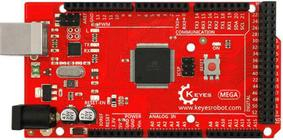|

